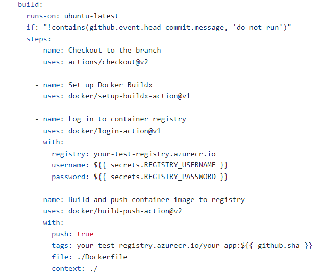

# GitHub Action for gradually deploying a new container application revision
## Usage
This Action requires four values and contains the option to customize multiple others.

The four required values are:
- appName: the name of the container application to deploy to
- resourceGroup: the name of the resource group the application is located under
- imageID: the image ID of the new revision that is being pushed
- revisionSuffix: the unique suffix of the new revision being created

Customizable values are:
- logAnalyticsWorkspace: the name of the log analytics workspace associated with the container application and an indication to monitor log analytics for a particular application (default none)
- canaryDeploy: opt into using the canary method of deployment, which is a two-step process to increase traffic to the stepPct and monitor before increasing immediately up to finalPct traffic, as opposed to a linear method of traffic increase (default false)
- stepPct: the amount of traffic increase that should be added to the new revision at each step (default 10%)
- stepTime: the time to pause at each step before increasing traffic again. It is recommended that this be over 5 minutes because of metric latency (default 15 minutes)
- finalPct: the final percentage of traffic to divert to the new revision (default 100%)
- apiEndpointstoTest: user-provided endpoints that the Action will ping--upon a 2xx response the traffic shaping will continue, and upon a 5xx response the shaping will end and rollback will occur (default none)
- monitorInterval: time interval between monitoring at each step (default 1 minute)
- errorThreshold: threshold of natural 5xx responses out of all responses to receive before rolling back (default 0.5%)

The Action will automatically set revision mode to Multiple while it is running, and will revert the mode to Single if that was the initial setting. If an error occurs, previous traffic settings will be restored and traffic will be diverted back to the revisions that were handling requests prior to creation of the new revision.

# Continuous Development
Though the Action could be run manually by creating a workflow and changing the imageID and revisionSuffix on each run, the purpose and intent of the project is to utilize a CI/CD method of deployment with application code stored in GitHub. This can be accomplished in two ways: through an automatically generated template in the Azure Portal (recommended) or using a custom workflow.

## Integration with the Azure Portal
The simplest and highly recommended way to add SmartDeploy to your container application is to use the Azure Portal. Select your container application and choose "Continuous deployment" under the Settings division on the left menu. Integrate the container application with a particular GitHub repository, and a workflow will automatically be generated for you with login secrets built in. This workflow checks out the code in your repository, creates a new image in your Azure container registry, and on a push action.

Currently, this auto-generated template *does not* call the SmartDeploy GitHub Action. In order to add it, replace the "Deploy to containerapp" step that currently exists under the "deploy" job that uses the azure/CLI GitHub Action with this Action and its required parameters.

## Integration with a custom GitHub workflow
### Code checkout and image creation
For continuous integration, code that is stored in GitHub must be checked out to be accessed. The [Checkout GitHub Action](https://github.com/marketplace/actions/checkout) is the canonical way to accomplish this.

A new image should be created with this checked out code and can be accomplished using the [Docker Setup Buildx](https://github.com/marketplace/actions/docker-setup-buildx), [Docker Login](https://github.com/marketplace/actions/docker-login), and [Docker Build and Push](https://github.com/marketplace/actions/build-and-push-docker-images) GitHub Actions. 

See the example below for a way to build and push container images out of repository code with defined secrets of the registry username and password.

### Azure Subscription Login
The success of the Action is dependent on the [Azure Login](https://github.com/marketplace/actions/azure-login) GitHub Action, which allows users to log into the subscription that the container application (and log analytics workspace) is created under. 

The Azure Login Action allows for two methods of authentication: using the Azure Service Principal with secrets or using OpenID connect with a Federated Identity Credential. See the [documentation for Azure Login](https://github.com/marketplace/actions/azure-login#configure-deployment-credentials) to correctly integrate.

The SmartDeploy GitHub Action can ONLY be run after logging in first with the Azure Login Action. Attempts to use SmartDeploy without log-in will result in an error and failure to create a new revision and deploy.

### SmartDeploy Use
SmartDeploy can then be added as a last step, with four required parameters.

